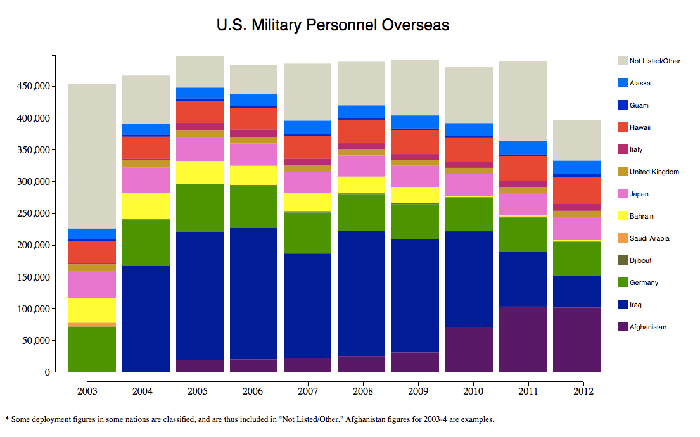

# D3-Stacked-Bar-Graph
[Live Example](http://sotufactcheck.org/military_deployments/military_deployments.html)

A data visualization that adjusts to optimally render series data (Created 2013 by Tomer Ovadia).



## Overview
This code generates a stacked a stacked bar graph from data in CSV format. Almost all features (bar length and height, number of bars, margin sizes, axes size and labels, etc) adjust automatically to fit the data loaded and the size specifications requested.

The data in the CSV is imported into dataset, an array of arrays of numbers.

```Javascript
d3.text("filename.csv", "text/csv", function(text) {
     var dataset = d3.csv.parseRows(text);
```

Each array is used to to form a single bar, with its numbers used to determine the height of each rectangle of the stacked bar.

Users define the width and the height of the canvas containing the bars, as well as the surrounding margins on each end.

```Javascript
 //Defines the margin sizes
     var margin = {top: 80, right: 180, bottom: 60, left: 100},
     //Defines dimensions of the area containing the bars
     w = 850,
     h = 500;
```

This information is then used to create the SVG, which is the larger canvas on which the graph, axes, legend and title will be created.

```Javascript
     //Creates the SVG
     svg = d3.select("body")
     .append("svg")
     .attr("width", w + margin.left + margin.right)
     .attr("height", h + margin.top + margin.bottom);
```

The main section of code is the iteration that cycles through the dataset array to create a bar out of each array it contains. Three attributes are needed to define each rectangle: position, size and color.

## Position

The program must know where to place each rectangle. D3 positions a rectangle using the “x” attribute, which defines its horizontal position from the left edge of the SVG, as well as the “y” attribute, which defines its vertical position from the top edge.

For this graph, the “x” attribute stays the same for the rectangles within each bar (in order for them to align perfectly as they stack) but increases as more bars are created from left to right.

In order to shift the bars right as more are created (so that they don't overlap), the code uses the variable distanceFromLeft. It is declared prior to the iterations that place the rectangles, with an initial value equal to the size of the left margin.

```Javascript
var distanceFromLeft = margin.left;
```

At the very end of each iteration that creates a bar, this value is increased so that its next use places the next bar further to the right by an amount equal to the width of the bar (barWidth) plus the padding predefined to provide space between the bars.

```Javascript
distanceFromLeft += barWidth + padding;
```

While padding is defined by the user, the width of the bar is calculated by considering the width of
the bar area (w) as well as the number of bars to be created (dataset.length).

```Javascript
var barWidth = w / (dataset.length-1) - padding;
```

The “y” attribute is trickier, as it needs to change for the creation of each rectangle, to position the rectangles so that they stack on top of one another. The program accomplishes this by determining how much white space is needed above the bar (dropDown) as well as by keeping track of the accumulated height of the rectangles that have already been created (accumulatedHeight), so that each subsequent rectangle can be created further and further down.

The dropDown variable is calculated by taking the height of the canvas that is to contain the bars, adding the top margin and subtracting the total height of the bar to be created (datasetSum). The total height of the bar is calculated simply by summing the values of the array, which contains the heights of the rectangles that are to create the bar. These calculations are done within the main iteration, so that datasetSum is recalculated for each bar.

```Javascript
     for (var c=0;c<dataset[a].length;c++){
           datasetSum = datasetSum + parseFloat(dataset[a][c]);
     }
     dropDown = h + margin.top - scale(datasetSum);
```

With this variable defined, the section of the code that creates the rectangles can use it to determine the “y” attribute. It also uses the accumulatedHeight variable, grows by each rectangle's height after each iteration in order to stack the rectangles below each other as they are created. Thus, the “y” attribute is simply the dropDown (to skip over the white space) plus the accumulatedHeight (to skip over the existing rectangles). (Note: The accumulatedHeight is passed through a scale to accommodate a wide variety of data magnitudes, a strategy explained later).

```Javascript
.attr("y", function(d, i){ //how far down the bar addition will be if(i===0){ //if it's the first, just create it
                 return scale(accumulatedHeight) + dropDown;
              }
              if(i>0){ //after the first, create it lower down
                 accumulatedHeight += parseFloat(dataset[a][i-1]);
                 return scale(accumulatedHeight) + dropDown;
              }
})
```

In order to create each rectangle, the program also needs to know its size, specifically its width and height.

The width of each rectangle is simply the barWidth, which was discussed above in regard to the “x” attribute, and which was defined with consideration of the width of the SVG and the number of bars.

```Javascript
  .attr("width", barWidth)
```

The height of the bar is one of the most important attributes of the entire graph, as it is the metric that depicts the data. It is defined by simply applying a scale to the datum contained in the array for the corresponding rectangle being created.

```Javascript
.attr("height", function(d){ //height of bar part is simply the scaled datum return scale(d);
})
```

## Size
The scale is established early in the code (prior to the main iteration). Its domain has a lower limit of 0 and an upper limit equal to the height of the tallest bar (maxBarHeight). Its range is simply between 0 and h, the predefined height of the canvas containing the bars. In other words, the tallest bar in the resulting graph could be expressed in two ways:

  * its actual value (for example, number of military troops deployed), and
  * its scaled value (the height of the bar as it appears on screen).

The former is the domain, and the latter is the range. All heights are scaled to this rule.

```Javascript
     //Defines the scale conversion
     var scale = d3.scale.linear()
           .domain([0, maxBarHeight])
           .range([0, h]);
```

In order to determine maxBarHeight, the code must iterate completely through the dataset. The variable barHeightsSample is created to keep track of the accumulated bar height as the data (height of a rectangle) is summed to determine the total height if the rectangles were to be stacked into a bar. After the height of a bar is determined, it is pushed into an array (barHeights) that collects all the bar heights.

```Javascript
        //Calculates the maximum bar height
        var barHeights = [];
        var barHeightSample;
        var maxBarHeight = 0;
        for(var j=1;j<dataset.length;j++){
            barHeightSample = 0;
            for (var i=0;i<dataset[j].length;i++){
barHeightSample = barHeightSample + parseFloat(dataset[j][i]); }
            barHeights.push(barHeightSample);
        }
```

After the array barHeights is completed, another iteration cycles through it to determine maxBarHeight, redefining the variable if it discovers a taller bar.

```Javascript
        for (var b=0;b<barHeights.length;b++){
            if (barHeights[b] > maxBarHeight){
                maxBarHeight = barHeights[b];
            }
}
```

## Color
The rectangles are assigned different colors in order to make them differentiable from the rectangles above and below them. Permitted colors are defined by the user in the array color.

```Javascript
     //Defines color palette
     var color = ["#D6D6C2", "#0066FF", "#0000CC", "#FF3300", "#CC0066",
     "#CC9900", "#FF66CC", "#FFFF00", "#FF9933", "#666633", "#009900",
     "#000099", "#660066"];
```

Applying the color attribute to a rectangle is simple. If the index that keeps track of which rectangle is being create (i) is less than the size of the array color, color[i] is simply assigned as the color.

However, in some cases there may be more rectangles in a bar than there are defined colors. As soon as the code uses all the colors available (detected by noting that i is greater than the size of the array color), the code redefines i as i – color.length so that when color[i] is returned, it jumps back to the first element in colors. The next rectangle will receive the second color in color, and so on. Another if statement is included to allow one more cycle of the colors if they are all used yet again, this time decreasing i by `color.length*2`.

```Javascript
.attr("fill", function(d,i){ //cycles thru the colors defined above if(i < color.length){
                  return color[i];
              }
              if(i >= color.length && i < (color.length*2)){
                  i -= color.length;
                  return color[i];
              }
              if(i >= (color.length*2)){
                  i -= color.length*2;
                  return color[i];
              }
} )
```

Now that the bars are all created, the program proceeds to create axes and a legend.

## x-Axis

In order to create the x-axis, a scale, orientation and position must be defined.

The domain of the scale is a manually inputted spectrum (in this case, years). The range is 0 through the width of the canvas depicting the bars, slightly adjusted using the left margin.

```Javascript
     var xAxisScale = d3.scale.linear()
                     .domain([2003, 2012])
                     .range([0, w - margin.left*(2/3)]);
```

This scale is then applied to the x-axis, along with the orientation of “bottom,” and a manually inputted appropriate tick format (in this case, years).

```Javascript
     var xAxis = d3.svg.axis()
                       .scale(xAxisScale)
                       .orient("bottom")
                       .tickFormat(d3.format("Y"));
```

Finally, the x-axis is generated and called. Its position from the left edge is simply the left margin plus a buffer, and its position from the upper edge is the upper margin plus the height of the canvas with the bars plus an adjustment.

```Javascript
     svg.append("g")
         .attr("class", "axis")
         .attr("transform", "translate(" + parseFloat(margin.left + 30) +
     "," + parseFloat(margin.top + h + 15) + ")")
         .call(xAxis);
```

It's worth noting that the class axis was previously defined in the page's CSS in order to define the style of the axes.

```Javascript
     .axis path,
     .axis line {
         fill: none;
         stroke: black;
         shape-rendering: crispEdges;
}
```

## y-Axis
The y-axis is created very similarly to the x-axis. The differences are its scale (which considers h as well as the previously defined maxBarHeight), its orientation (“left”) and its position (determined by considering the top margin and a buffer from the left).

```Javascript
     var yAxisScale = d3.scale.linear()
           .domain([0, maxBarHeight])
           .range([h, 0]);
     var yAxis = d3.svg.axis()
           .scale(yAxisScale)
           .orient("left");
     svg.append("g")
           .attr("class", "axis")
           .attr("transform", "translate(" + 80 + "," + margin.top + ")")
           .call(yAxis)
           .selectAll("text");
```

## Legend

The legend labels the colors that were attributed to the rectangles, so that a viewer can visualize what factors are contributing to changes in the total bar heights.

The legend is created with an entirely separate iteration through the dataset, with each cycle creating a small colored box alongside its corresponding word drawn from the first line of the CSV file.

### Legend Color Boxes

In order to create a small colored boxes in the legend, the program needs to know its position, size and color.

The size of the legend color boxes and the padding between legend lines are simply predefined, as they are matters of preference.

```Javascript
     var legendBoxWidth = 15;
     var legendBoxHeight = 15;
     var legendPadding = 20;
```

These attributes are applied directly to each rectangle.

```Javascript
     .attr("height", legendBoxHeight)
     .attr("width", legendBoxWidth)
```

Since the boxes should be to the right of the canvas with the bars, the “x” position of the boxes is the left margin plus the width of the canvas with the bars (w) plus a small portion of the right margin for buffer.

```Javascript
     .attr("x", w + margin.left + margin.right*(1/10))
```

Just like with the creation of the bars, the “y” position is more complicated, as additions to the legend need to be lower down as more lines are created. The distance from the top edge is defined as the top margin plus an additional amount proportional to how many entries in the legend have already been created. For example, the first line is created simply just below the top margin. The second line is created at a “y” position that not only takes into account the top margin, but also adds the legendBoxHeight and the legendPadding predefined variables, in order to push this addition comfortably below the prior line.

```Javascript
.attr("y", function(d, i){

return margin.top + i * (legendBoxHeight + legendPadding) + "px"; })
```

The color of the box is determined exactly as the colors were determined for the rectangles.

```Javascript
     .attr("fill", function(d,i){ //cycles through the colors defined above
           if(i < color.length){
                return color[i];
           }
           if(i >= color.length && i < (color.length*2)){
                i -= color.length;
           return color[i];
           }
if(i >= (color.length*2)){
                i -= color.length*2;
                return color[i];
           }
})
```

The text that accompanies the colored legend boxes is added in a separate iteration through the dataset, but in a very similar way to how the boxes themselves were added. The main differences are the attributes of the text as well as a slightly different “x” attribute in order to push the text further to the right, alongside (rather than on top of) the boxes. Also, the text that is applied is simply the first row of data drawn from the array generated by the CSV.

```Javascript
     //Legend text
     svg.append("g").selectAll("text")
               .data(dataset[0])
               .enter()
               .append("text")
               .text(function(d) {
                     return d})
               .attr("font-family", "sans-serif")
               .attr("font-size", "11px")
               .attr("x", w + margin.left + margin.right*(1/5))
               .attr("y", function(d, i){
                        return margin.top + i * (legendBoxHeight + legendPadding) +
12 + "px"; });
```

Finally, a simple title and supplementary HTML text are added, and the automatically adjusting stacked bar graph is complete.
